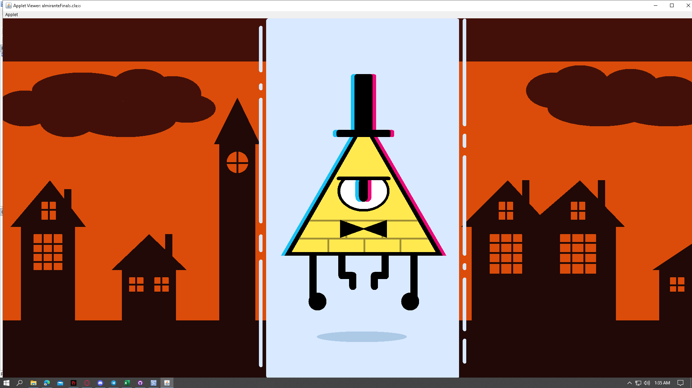

# 🎨 Applet Cartoon  
## 🌀 Bill Cipher from Gravity Falls  
Created in compliance with **DCIT50A | First Semester - Finals | 2nd Year College**

A Java applet project that visually recreates the character **Bill Cipher** from the animated series *Gravity Falls*. This submission demonstrates the use of Java AWT graphics to draw a recognizable cartoon figure programmatically using shapes, lines, and color fills.

### ✏️ Features

- Java Applet-based graphical output
- Uses `Graphics` class for shape rendering
- Custom colors and positioning to replicate the character
- Educational project focused on Java GUI fundamentals

### 🛠️ Technologies Used

- Java  
- AWT (Abstract Window Toolkit)  
- Applet Viewer / Java IDE with Applet support

### 📷 Preview

